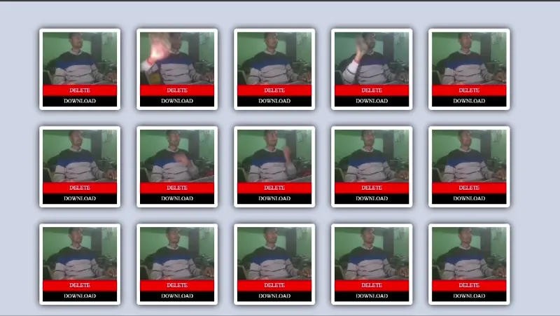
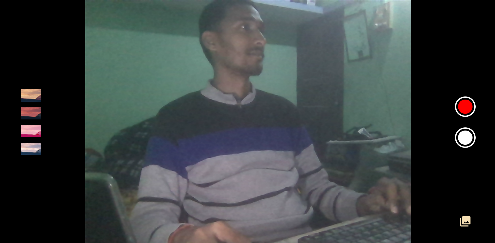
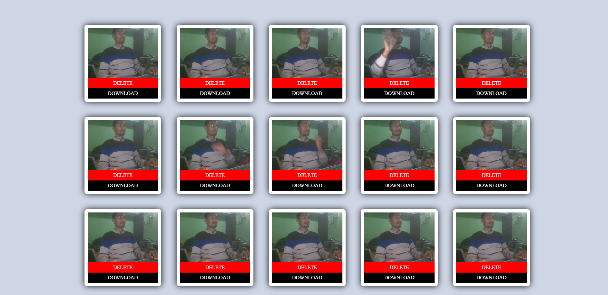

### Camera Gallery

This is a simple web-based camera and gallery application built to understand the basic of HTML, CSS, JS, and web APIs like DOM, UI Events, IndexedDB, MediaRecorder and so on.

- [preview](https://example.com/)

<center>
<div style="display:flex; flex-wrap:wrap; margin:3rem; justify-content:center;">

</div>
<div style="display:flex; flex-wrap:wrap; gap:1.5rem; justify-content:center;">


</div>
<center>

##### Features

- Capture Picture and Videos from web camera
- Apply Filter
- View all captured images in a gallery layout (locally in indexedDB)
- Download images or videos

##### Technologies used

- HTML5
- CSS3
- JavaScript
- Browser APIs

##### Setup and Installation

- Clone the repository:

```bash
git clone https://github.com/AbhiArya20/camera-gallery.git
```

- Navigate to the project directory:

```bash
cd simple-camera-gallery
```

- Open the index.html file in your browser
